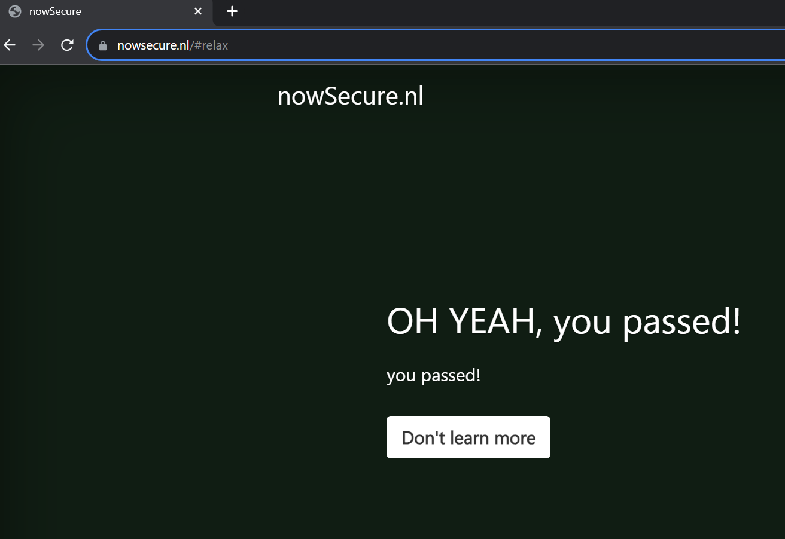
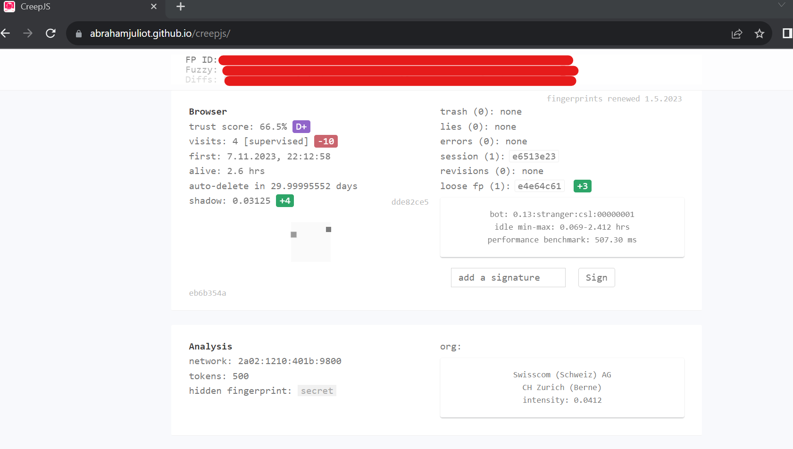

# 🎭 [Playwright](https://playwright.dev) for Python 

[](https://badge.fury.io/py/undetected-playwright-patch)

This is a patch of the original playwright implementation for Python.

It currently passes for sure (tested on Win10):
- ✅ [CloudFare] 
- ✅ [Bet365] (shape//F5 I think)
- [Others] Unknown/Not tested

Warnings: 
* the **Only chromium** part for Playwright is patched.
* This will overwrite your default playwright package.

Note: For testing with Playwright and undetected-playwright, use multiple venv's

## Demos (tested on Win 10)




## Dependencies

* Google-Chrome installed (`channel="chrome"` recommended)

## Installation

#### From PyPi (recommended)

execute in your shell console
```shell
pip install unetected-playwright-patch
```

#### Build from this repo:
```
git clone https://github.com/kaliiiiiiiiii/undetected-playwright-python
cd undetected-playwright-python
python -m pip install -r local-requirements.txt
python build_patched.py
```

[//]: # (run `pip install undetected-playwright-python` in your terminal)

## Example

```python
import asyncio

# undetected-playwright here!
from playwright.async_api import async_playwright, Playwright


async def run(playwright: Playwright):
    args = []
    
    # disable navigator.webdriver:true flag
    args.append("--disable-blink-features=AutomationControlled")
    browser = await playwright.chromium.launch(channel="chrome", headless=False,
                                               args=args)
    page = await browser.new_page()
    await page.goto("https://nowsecure.nl/#relax")
    input("Press ENTER to continue to Creep-JS:")
    await page.goto("https://nowsecure.nl/#relax")
    await page.goto("https://abrahamjuliot.github.io/creepjs/")
    input("Press ENTER to exit:")
    await browser.close()


async def main():
    async with async_playwright() as playwright:
        await run(playwright)


if __name__ == "__main__":
    loop = asyncio.ProactorEventLoop()
    loop.run_until_complete(main())
    # asyncio.run(main) # should work for non-Windows as well
```

```py

# undetected-playwright here!
from playwright.sync_api import sync_playwright


with sync_playwright() as p:
    args = []
    
    # disable navigator.webdriver:true flag
    args.append("--disable-blink-features=AutomationControlled")
    browser = p.chromium.launch(args=args, headless=False, channel="chrome")
    page = browser.new_page()
    page.goto("https://nowsecure.nl/#relax")
    input("Press ENTER to continue to Creep-JS:")
    page.goto("https://nowsecure.nl/#relax")
    page.goto("https://abrahamjuliot.github.io/creepjs/")
    input("Press ENTER to exit:")
    browser.close()
```

## Documentation

See the original
[https://playwright.dev/python/docs/intro](https://playwright.dev/python/docs/intro)

## API Reference

[https://playwright.dev/python/docs/api/class-playwright](https://playwright.dev/python/docs/api/class-playwright)


## Patches
- [ ] [`Runtime.enable`](https://chromedevtools.github.io/devtools-protocol/tot/Runtime/#method-enable)
  - [x] remove Runtime.enable occurences
  - [x] patch _context(world) getter
    - [x] isolatedWorld (utility)
    - [ ] main world (main)
    - [x] reset on frame-reload//navigation

## TODO's

- [ ] make setup.py compatible for pypi uploads
- [ ] add GitHub runner to build releases automated

